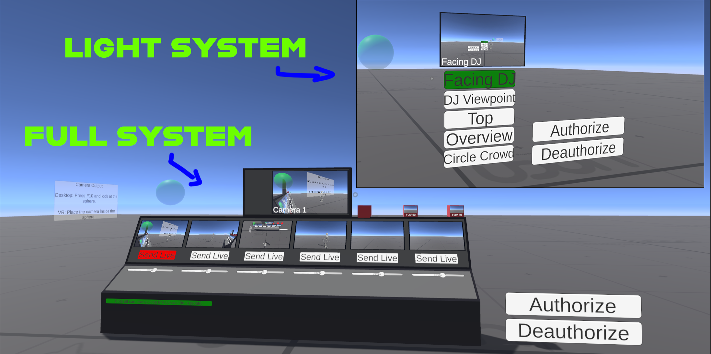

# Camera System

Just import the unitypackage or do things with this repository if you are playfull.

An example scene has been provided with everything already setup in place.

Otherwise prefabs are provided, but I can't guarantee everything will work, so best way is to open the scene along your actual one, and move the system you want, then adapt stuff.

There is two systems:

- A full one, with three fixed cameras and three handhelds
- A light one with only one camera and a few position presets

# Notes

In the `Camera System_Console` UdonBehavior, all the lists like Cameras objects or cameras materials etc. have to be IN ORDER (1, 2, 3, 4...).

The same `Camera System_Console` U# script has a basic auth hook, by default, nobody can play with the FOV or change the live camera or move the handhelds, your external script, or buttons etc. have to call the `authorize` and `deauthorize` for each user that have to have access. Like from a keypad asset or your own system.
The camera light system also have this auth hook.

By default the potato mode is enabled, authorizing the user disable it.

# Known issues

There is no "Follow player" system yet.

Everything should be synced but that haven't been real-world tested yet.

Maybe other bugs, idk.

# Help/Support

This is provided "as-is", Very GoodTM bug reports might gets answered but I have others things to do and ADHD so this is as-is if it can help anyone.

Contributions for bug fixes or features welcome though

# Credits
Camera System by Ottpossum/dashie.

The Camera override Shader is by kurotori, released under MIT, see https://booth.pm/en/items/4848817

# License
MIT License
